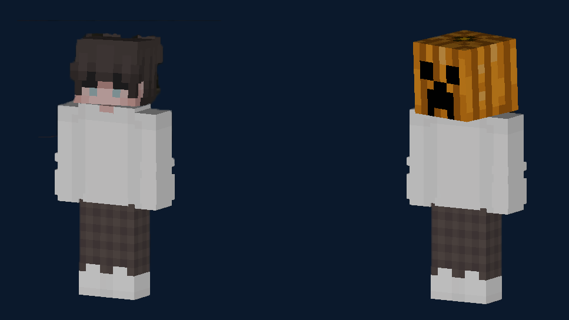
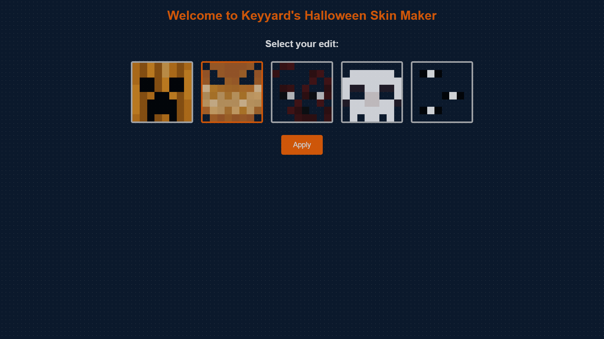
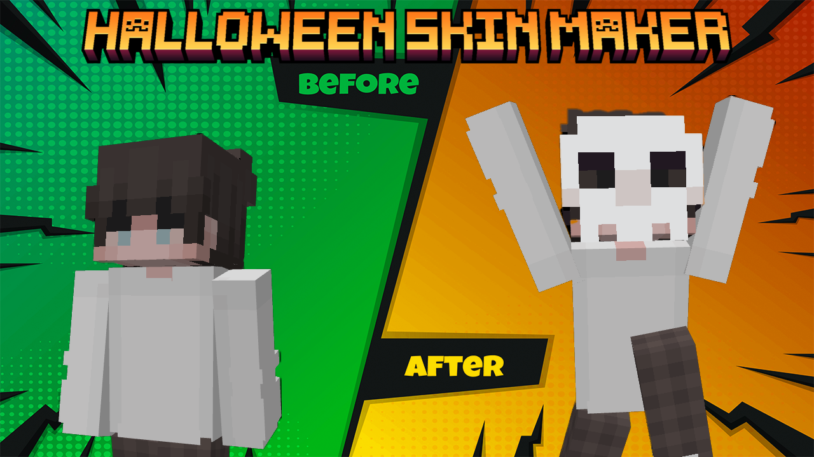

# Keyyard's Halloween Skin Maker 🎃

Welcome to Keyyard's Halloween Skin Maker! This web app lets you add spooky customizations to your Minecraft skin. Upload your skin, choose a Halloween-themed overlay, and download your new look. It's that simple!








## Features

- **User-Friendly Interface:** Easy to use.
- **Upload Your Skin:** Import your Minecraft skin.
- **Choose And Create Your Own Customizations:** Create your own Halloween-themed overlays or choose from the existing ones.
- **Download Your Creation:** Get your customized skin ready for Halloween.

## Getting Started

### Prerequisites

- Python 3.x
- `pip` (Python package installer)

### Installation

1. **Clone the repository or download the ZIP:**
   ```bash
   git clone {this-repository-url}
   cd halloween-skin-maker
   ```

2. **Install the required packages:**
   ```bash
   pip install -r requirements.txt
   ```

3. **Run the Flask application:**
   ```bash
   python app.py
   ```

4. **Open your web browser and navigate to `http://127.0.0.1:5000/`.**

## Usage
After running the Flask application, you can upload your Minecraft skin and choose a Halloween overlay to customize your skin. Once you're satisfied with your creation, you can download the new skin and use it in Minecraft.

## Contributing

You can contribute overlays and submit pull requests to add more Halloween-themed customizations to the app. We welcome any contributions to improve the app and make it more fun for everyone.

## Acknowledgements

- [Flask](https://flask.palletsprojects.com/)
- [Pillow](https://python-pillow.org/)

Happy Halloween!!